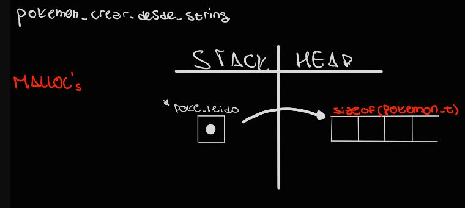
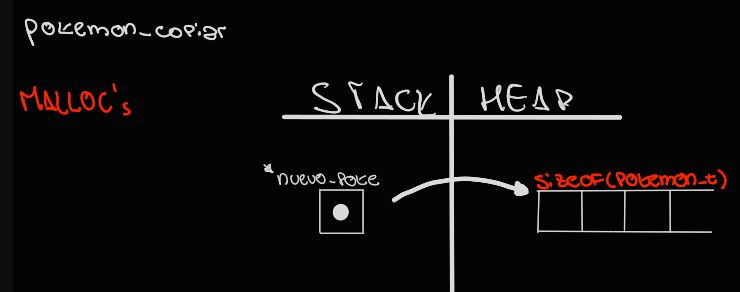
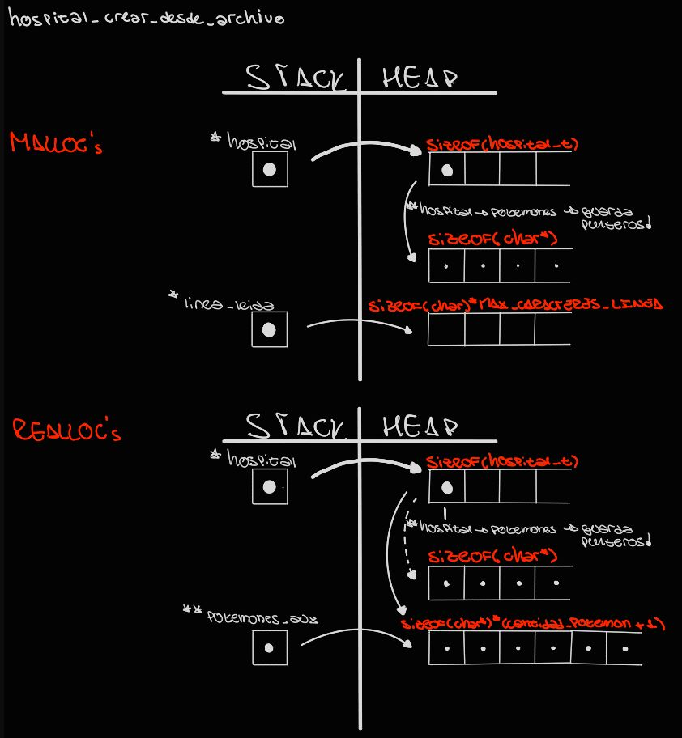
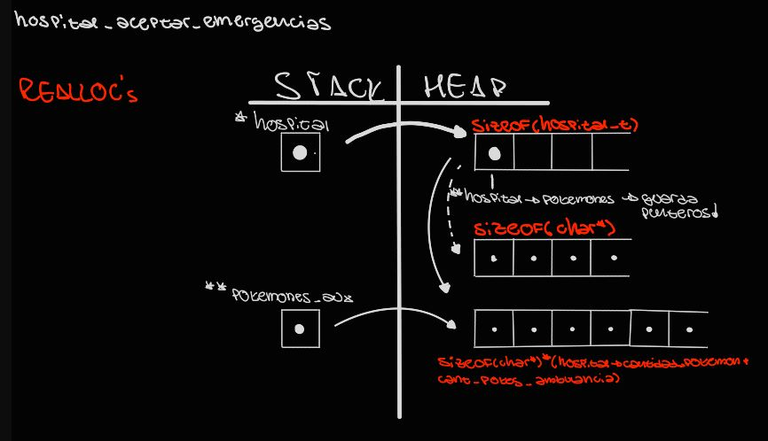

<div align="right">

</div>

# TP1

## Repositorio de John O'Connor - 110102 - johnoc1712@gmail.com

- Para compilar:

```bash
gcc src/*.c pruebas_chanutron.c -std=c99 -Wall -Wconversion -Wtype-limits -pedantic -Werror -O2 -g -o pruebas_chanutron
```

- Para ejecutar:

```bash
./pruebas_chanutron
```

- Para ejecutar con valgrind:
```bash
valgrind --leak-check=full --track-origins=yes --show-reachable=yes --error-exitcode=2 --show-leak-kinds=all --trace-children=yes ./pruebas_chanutron
```
---
##  Funcionamiento

En cuanto al desenvolvimiento del tp1, se modificaron y desarrollaron estructuras de algoritmos en dos archivos; `tp1.c` y `pokemon.c`.

Archivo `pokemon.c`:

`pokemon_crear_desde_string` en primera instancia, verifica que el string pasado por parámetro sea válido (distinto de `NULL` y no vacío). A continuación reserva un bloque de espacio en memoria dinámica mediante `malloc` para `*poke_leido` (verificando que se reserve correctamente), a fin de poder guardar los datos leidos del string mediante `sscanf` en los correspondientes campos de `*poke_leido`, para finalmente devolver `*poke_leido`, en caso de que se hayan leido bien los datos, o en caso contrario liberar el espacio reservado en memoria mediante `free` y devolver `NULL` en señal de error. El siguiente esquema representa el manejo de memoria al reservar el espacio con `malloc`:




Luego, `pokemon_copiar` verifica que el `pokemon_t` pasado por parámetro sea válido (distinto de `NULL`). Reserva un bloque de espacio en memoria dinámica por `malloc` para `*nuevo_poke` (verificando que se reserve correctamente). A continuación copia los datos de cada uno de los campos de `*poke` en `*nuevo_poke` y por último devuelve `*nuevo_poke`. El siguiente esquema representa el manejo de memoria al reservar el espacio con `malloc`: 




`pokemon_son_iguales`, verifica que ambos de los `pokemon_t` enviados por parámetro no sean `NULL`, devuelve `false` en caso de que alguno de los campos de `*pokemon1` sea igual al respectivo campo de `*pokemon2`, y `true` en caso contrario.

`pokemon_nombre` verifica que el `pokemon_t` enviado por parámetro no sea `NULL` y devuelve el campo `pokemon->nombre`.

`pokemon_entrenador` verifica que el `pokemon_t` enviado por parámetro no sea `NULL` y devuelve el campo `pokemon->nombre_entrenador`.

`pokemon_salud` verifica que el `pokemon_t` enviado por parámetro no sea `NULL` y devuelve el campo `pokemon->salud`.

`pokemon_id` verifica que el `pokemon_t` enviado por parámetro no sea `NULL` y devuelve el campo `pokemon->id`.

`pokemon_destruir` verifica que el `pokemon_t` enviado por parámetro no sea `NULL` y libera el bloque de espacio reservado en memoria para el mismo mediante `free`.


Archivo `tp1.c`:

`hospital_crear_desde_archivo` Comienza verificando que el archivo no sea `NULL` en cuyo caso devuelve dicho valor. Luego abre el archivo pasado por parámetro mediante `fopen` en modo lectura, también verificando que se abra correctamente. Luego reserva un bloque de espacio en memoria dinámica mediante `malloc` para `*hospital`, verificando si se reserva correctamente. Mismo hace para `hospital->pokemones`, y para `*linea_leida` con sus respectivos tamaños necesarios. 
En las verificaciones realizadas, el algoritmo se encarga de liberar los espacios en memoria correspondientes. Guarda en `*linea_leida` la linea del archivo leida mediante `fscanf`, guardando el valor devuelto por la función en `leido`, variable con la cual verifica que el archivo sea válido, no vacío y el valor de EOF. 
Dentro del `while` se crean e inicializan los diferentes índices del vector `hospital->pokemones` utilizando la función `pokemon_crear_desde_string`, y actulizan los valores correspondientes del `hospital` para reflejar los cambios de pokemones y entrenadores (asumiendo que los entrenadores no se repiten, aunque tengan el mismo nombre). 
A continuación, se aumenta adecuadamente el tamaño del espacio en memoria reservado para `hospital->pokemones` mediante `realloc`, guardando el resultado del mismo en `**pokemones_aux` para así no perder la dirección de memoria del vector original en caso de que no se haya podida realizar el `realloc` correctamente. Realiza las verificaciones necesarias y luego iguala la dirección de memoria de `hospital_pokemones` a la de `pokemones_aux`.

Con el siguiente algoritmo, una vez ya leido completamente el archivo, fuera del `while` se ordena mediante _burbujeo_ el vector `hospital->pokemones` creado con anterioridad, tomando como criterio el campo `salud` dentro de `hospital->pokemones`, de menor a mayor. Durante este proceso, sea realizan liberaciones de espacio de memoria correspondientes, al invocar la función `pokemon_copiar`, evitando así pérdidas de memoria.

```c
bool esta_ordenado = false;
while (!esta_ordenado) {
    esta_ordenado = true;
    for (int i = 0; i < (hospital->cantidad_pokemon) - 1; i++) {
        if (pokemon_salud(hospital->pokemones[i + 1]) <
            pokemon_salud(hospital->pokemones[i])) {
            esta_ordenado = false;
            pokemon_t *aux =
                pokemon_copiar(hospital->pokemones[i]);
            free(hospital->pokemones[i]);
            hospital->pokemones[i] = pokemon_copiar(
                hospital->pokemones[i + 1]);
            free(hospital->pokemones[i + 1]);
            hospital->pokemones[i + 1] =
                pokemon_copiar(aux);
            free(aux);
        }
    }
}
```

El respectivo diagrama de memoria:




`hospital_cantidad_pokemones` verifica que el `hospital_t` pasado por parámetro sea válido, y devuelve `hospital->cantidad_pokemon`, la cantidad de pokemones.

`hospital_a_cada_pokemon` verifica que los parámetros sean válidos, y aplica a cada indice del vector `hospital->pokemones` la función pasada por parámetro, siempre y cuando esta devuelva `true` y todavía haya pokemones en dicho vector. Devuelve `contador`, la cantidad de veces que se aplicó la función, independientemente del resultado.

`hospital_aceptar_emergencias` verifica que los parámetros sean válidos, y luego aumenta el bloque de espacio en memoria dinámica reservado para `hospital->pokemones` mediante `realloc`, guardando el resultado de la función en `**pokemones_aux`, para no perder la dirección de memoria original en caso de que falle el `realloc`, y en caso contrario, iguala la dirección de memoria de `hospital_pokemones` a la de `pokemones_aux`. Luego dentro del `for`, se desarrolla el código encargado de isnertar ordenadamente los pokemones de `pokemones_ambulancia` en `hospital->pokemones`, (hablando de los punteros a direcciones de memoria).

Más específicamente, este algoritmo determina el índice a insertar el puntero del correspondiente pokemon de `pokemones_ambulancia`, según su nivel de salud comparado con aquellos en `hospital->pokemones`.

```c
int indice_a_insertar = 0;
int j = 0;
bool indice_determinado = false;
while (j < hospital->cantidad_pokemon && !indice_determinado) {
    if (pokemon_salud(hospital->pokemones[j]) <=
        pokemon_salud(pokemones_ambulancia[i])) {
        indice_a_insertar++;
    } else {
        indice_determinado = true;
    }
    j++;
}
```
El siguente mueve los punteros de `hospital->pokemones`, posteriores al indice a insertar, un indice después en el vector, haciendo lugar para el pokemon a insertar.

```c
for (size_t k = hospital->cantidad_pokemon;
     k > indice_a_insertar; k--) {
    hospital->pokemones[k] = hospital->pokemones[k - 1];
}
```

Y finalmente este algoritmo inserta el pokemon correspondiente de `pokemones_ambulancia` en el indice indicado de `hospital->pokemones`, actualizando la cantidad de pokemones en el primero de estos.

```c
hospital->pokemones[indice_a_insertar] =
    pokemones_ambulancia[i];
hospital->cantidad_pokemon++;
```

A continuación el diagrama de memoria correspondiente a esta función.




Por último, `hospital_destruir`, asumiendo que el parámetro es válido, libera el espacio en memoria reservado para todos los indices de `hospital->pokemones`, para dicha estructura, y para `hospital` en sí.


## Respuestas a las preguntas teóricas
En el código, en la función `hospital_aceptar_emergencias`, se optó por realizar insersión ordenada de los nuevos pokemones en el vector del hospital, ya que esta opción resulta más eficiente en términos de recursos y complejidad computacional, comparado con insertar normalmente y lueg ordenar el vector original.
